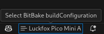
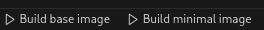

# luckfox-yocto

Pre-configured example of Yocto project for Luckfox boards.

## Description

This is an example and starting point for working with the [meta-rv110x](https://github.com/RamasyaR/meta-rv110x) metalayer, which currently only supports Luckfox Pico Mini A/B boards.

## Dependencies

* [Visual Studio Code](https://code.visualstudio.com/)
* [Yocto Project BitBake vscode extension](https://marketplace.visualstudio.com/items?itemName=yocto-project.yocto-bitbake)
* [Task Buttons vscode extension](https://marketplace.visualstudio.com/items?itemName=spencerwmiles.vscode-task-buttons)

## Quick Start
1. Install vscode
2. Install extensions
3. Clone and open this repo in vscode
4. Select MACHINE using the button in the bottom right corner of the vscode window 

5. Build a basic/minimal image using the buttons in the bottom left corner of the vscode window 

6. Find the build result in the `build/tmp/deploy/images` directory
7. Copy image
    - SDCARD: Use `bmaptool` to copy the generated .wic file to the SD card
    - NAND: TODO
8. Boot your device
